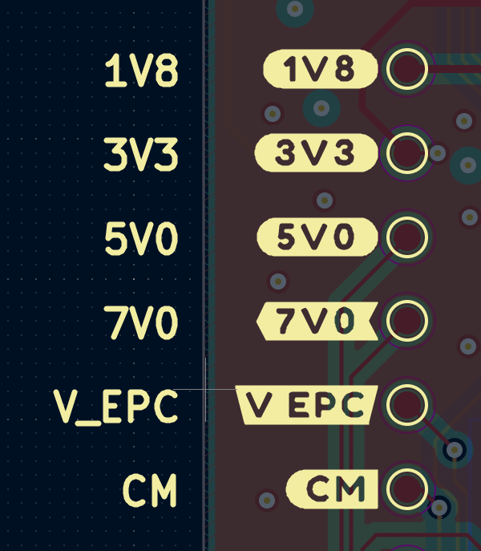

# Buzzard plugin for KiCad
    Note this plugin is currently a work in progress

Basic plugin wrapper for [Buzzard](https://github.com/sparkfunX/Buzzard). 

This plugin lets you easily create nice "Inverted" block text boxes.



## Installation
Install the script in your KiCad scripting directory
Ensure you also get the submodules with KiBuzzard
```console
$ git clone https://github.com/gregdavill/KiBuzzard
```

You may also need to install freetype libraries and xclip, to handle clipboard operations. 
On Ubuntu:
```console
$ sudo apt install xclip
$ pip install freetype-py
```

On Windows:
You may require the FreeType DLLs
Download FreeType dlls: https://github.com/ubawurinna/freetype-windows-binaries/releases/latest
Copy win64/freetype.dll into C:/Program Files/KiCad/5.99/bin

## Licence and credits

Plugin code licensed under MIT, see `LICENSE` for more info.

 - [Buzzard](https://github.com/sparkfunX/Buzzard) From SparkFun
 - KiCad Plugin/Dilog inspiration from [Interactive HTML BOM](https://github.com/openscopeproject/InteractiveHtmlBom/)
